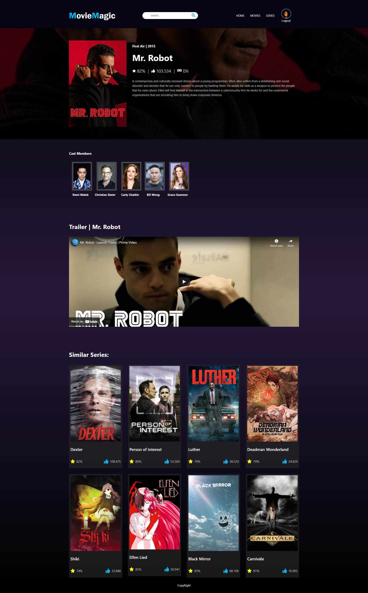

# Movie Magic Application
## App Functionalities 

### Home page
- What's popular (always with a link to the details page)
- Trending, Movies / Series, Popular (from API),Best rated (from API), (always with a link to the details page) 

- Search autofill
- Search for film and series (from API)
- Account:
    - Login (Firebase)
    - Logout (Firebase)
- Movie / series detail page, Image (from API), Synopsis (from API), Other ratings (from API), Cast (from API), movie or serie trailer, related movies or series

## Technology, library and framework used:
- React 
- Firebase database
- Storybook
- Faker JS : to seed the database with users
- React Router DOM : Client-side routing
- (SASS) (of Styled components)
  

## Movie Magic App Preview:

### Home page 

## Available Scripts

In the project directory, you can run:

### `npm start` inside the client folder
 
#### Home page:

#### Search Page:

#### Detail Page:

#### Movie Page:

